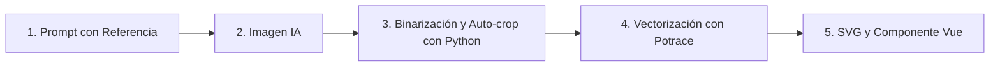

# 🐾 Guía de Generación de Mascotas SVG

Esta guía documenta paso a paso el flujo de trabajo utilizado para diseñar, generar, procesar y vectorizar nuevas variantes de la mascota kawaii de **Lector Bíblico**, garantizando una coherencia visual del 100% con la identidad del proyecto.

---

## 🎨 1. Anatomía y Estilo Visual de la Mascota

Todas las variantes deben respetar los siguientes rasgos distintivos:
* **Silueta base:** Forma redondeada y regordeta que evoca sutilmente la letra **B** (de *Biblia*).
* **Rostro kawaii:** Ojos de punto o líneas curvas sonrientes (`^_^`), boquita de gato tipo `:3` centrada, y 2 bigotes a cada lado de las mejillas.
* **Orejas y Cola:** Orejas redondas estilo oso/ratón y una colita curva en la parte posterior izquierda.
* **Estilo de trazo:** *Monoline* vectorial con líneas gruesas, suaves, continuas y sin sombras ni degradados.
* **Color adaptable:** Monocromático con `fill="currentColor"` para adaptarse dinámicamente a temas claro y oscuro mediante clases de Tailwind (`text-text1`, `text-text3`, `hover:text-hoverText1`, etc.).

---

## 🚀 2. Flujo de Trabajo (Paso a Paso)



---

### Paso 1: Generación de Imagen (Prompt Engineering)

Al generar una nueva variante con herramientas de IA (usando la imagen de la mascota original como referencia):

**Fórmula de Prompt recomendada:**
```text
Vector style monochrome line art icon illustration of the exact same cute kawaii mascot character from the reference image: a chubby cute cat/creature with round ears, [EXPRESIÓN DE OJOS: dot eyes / curved closed happy eyes], ':3' cat mouth, whiskers on cheeks, and a curved tail. The character is [ACCIÓN O ELEMENTO: e.g. wearing headphones listening to music / holding a cup of coffee / holding a magnifying glass]. Clean thick smooth outline strokes, minimalist monochrome black line art on pure solid white background, no gradients, no shading, no text, matching the exact art style and line thickness of the original reference character.
```

**Parámetros:**
* **Aspect Ratio:** `1:1`
* **Fondo:** Blanco puro (`#FFFFFF`)
* **Trazo:** Negro puro (`#000000`)

---

### Paso 2: Binarización y Auto-crop con Python (PIL)

Las imágenes generadas suelen contener pequeños artefactos de compresión JPEG o antialiasing en los bordes. Este script limpia la imagen a blanco/negro puro y ajusta el encuadre (*bounding box*) con un padding uniforme de 25px.

```python
# script: process_mascot.py
import os
from PIL import Image

def prepare_image(input_path, output_path, pad=25, threshold=150):
    img = Image.open(input_path).convert('L')
    
    # 1. Binarización a 1-bit (blanco y negro estricto)
    bw = img.point(lambda p: 255 if p > threshold else 0, '1')
    
    # 2. Detección de Bounding Box automático
    inv = img.point(lambda p: 255 if p <= threshold else 0, 'L')
    bbox = inv.getbbox()
    
    # 3. Recorte con padding
    crop_box = (
        max(0, bbox[0] - pad),
        max(0, bbox[1] - pad),
        min(img.size[0], bbox[2] + pad),
        min(img.size[1], bbox[3] + pad)
    )
    cropped = bw.crop(crop_box)
    cropped.save(output_path)
    print(f"✓ Imagen procesada: {output_path} (tamaño: {cropped.size})")

# Ejemplo de uso:
# prepare_image("mascot_draft.jpg", "mascot_bw.png")
```

---

### Paso 3: Vectorización a SVG Limpio (Potrace)

Utilizamos el algoritmo **Potrace** para trazar curvas Bézier ultra-suaves a partir del mapa de bits binarizado.

**Instalación:**
```bash
npm install potrace
```

**Script de Vectorización:**
```javascript
// script: trace_mascot.js
const potrace = require('potrace');
const fs = require('fs');

const params = {
  turdSize: 2,         // Elimina ruido de píxeles pequeños
  optCurve: true,      // Optimiza curvas Bézier
  alphaMax: 1.0,       // Suavizado de esquinas
  optTolerance: 0.2,   // Tolerancia de ajuste de curvas
  threshold: 128,
  blackOnWhite: true,  // Trazo negro sobre fondo blanco
  color: 'currentColor'// Permite adaptación con Tailwind
};

function traceToSvg(inputBwPath, outputSvgPath) {
  potrace.trace(inputBwPath, params, (err, svg) => {
    if (err) throw err;
    fs.writeFileSync(outputSvgPath, svg);
    console.log(`✓ SVG generado en: ${outputSvgPath}`);
  });
}

// Ejemplo de uso:
// traceToSvg("mascot_bw.png", "frontend/public/img/mascot-custom.svg");
```

---

### Paso 4: Creación del Componente Vue

Cada mascota se almacena como un componente Vue independiente en `frontend/components/` para facilitar su importación y uso en plantillas.

**Estructura estándar (`frontend/components/Mascot[Nombre].vue`):**

```vue
<template>
  <svg
    xmlns="http://www.w3.org/2000/svg"
    viewBox="0 0 [ANCHO] [ALTO]"
    fill="currentColor"
    fill-rule="evenodd"
    v-bind="$attrs"
  >
    <path
      d="[PATH_EXTRAÍDO_DEL_SVG]"
      stroke="none"
      fill="currentColor"
      fill-rule="evenodd"
    />
  </svg>
</template>
```

> **Nota:** `v-bind="$attrs"` permite pasar clases de Tailwind (`class="w-10 h-10 text-text3 hover:text-hoverText1 transition-colors"`) directamente al componente.

---

## 🛠️ 3. Script Todo-en-Uno (Pipeline Completo)

Puedes ejecutar el siguiente script en Node.js + Python para procesar un lote de imágenes y generar automáticamente los `.svg` y `.vue`:

```javascript
// scripts/generate-mascots.js
const { execSync } = require('child_process');
const potrace = require('potrace');
const fs = require('fs');
const path = require('path');

const variants = [
  { rawImage: 'raw_music.jpg', name: 'mascot-music', component: 'MascotMusic' },
  // Agrega más variantes aquí...
];

const publicDir = path.resolve(__dirname, '../frontend/public/img');
const componentsDir = path.resolve(__dirname, '../frontend/components');

async function run() {
  for (const v of variants) {
    const bwPath = `./tmp_${v.name}.png`;
    
    // 1. Procesar con Python
    execSync(`python3 -c "
from PIL import Image
img = Image.open('${v.rawImage}').convert('L')
bw = img.point(lambda p: 255 if p > 150 else 0, '1')
inv = img.point(lambda p: 255 if p <= 150 else 0, 'L')
bbox = inv.getbbox()
crop_box = (max(0, bbox[0]-25), max(0, bbox[1]-25), min(img.size[0], bbox[2]+25), min(img.size[1], bbox[3]+25))
bw.crop(crop_box).save('${bwPath}')
"`);

    // 2. Vectorizar con Potrace
    await new Promise((resolve, reject) => {
      potrace.trace(bwPath, {
        turdSize: 2,
        optCurve: true,
        alphaMax: 1,
        optTolerance: 0.2,
        threshold: 128,
        blackOnWhite: true,
        color: 'currentColor'
      }, (err, svg) => {
        if (err) return reject(err);

        // Guardar archivo SVG
        const svgPath = path.join(publicDir, `${v.name}.svg`);
        fs.writeFileSync(svgPath, svg);

        // Extraer viewBox y path para el componente Vue
        const viewBox = (svg.match(/viewBox="([^"]+)"/) || [])[1] || '0 0 800 800';
        const d = (svg.match(/d="([^"]+)"/) || [])[1] || '';

        const vueCode = `<template>
  <svg
    xmlns="http://www.w3.org/2000/svg"
    viewBox="${viewBox}"
    fill="currentColor"
    fill-rule="evenodd"
    v-bind="$attrs"
  >
    <path
      d="${d}"
      stroke="none"
      fill="currentColor"
      fill-rule="evenodd"
    />
  </svg>
</template>
`;
        fs.writeFileSync(path.join(componentsDir, `${v.component}.vue`), vueCode);
        fs.unlinkSync(bwPath); // Limpieza temporal
        console.log(`✓ Creado: ${v.name}.svg y ${v.component}.vue`);
        resolve();
      });
    });
  }
}

run();
```

---

## 📁 4. Colección Actual de Mascotas en el Proyecto

| Componente | SVG en `public/img/` | Estado / Propósito |
| :--- | :--- | :--- |
| `<Mascot />` | `mascot.svg` | Original leyendo un libro 📖 |
| `<MascotWaving />` | `mascot-waving.svg` | Saludando con la pata 👋 |
| `<MascotThinking />` | `mascot-thinking.svg` | Pensando con incógnita ❓ |
| `<MascotSearch />` | `mascot-search.svg` | Buscando con lupa 🔍 |
| `<MascotHeart />` | `mascot-heart.svg` | Abrazando corazón (Favoritos) 💖 |
| `<MascotNotes />` | `mascot-notes.svg` | Tomando notas con libreta y lápiz ✏️ |
| `<MascotMusic />` | `mascot-music.svg` | Con audífonos escuchando música 🎧 |
| `<MascotPrayer />` | `mascot-prayer.svg` | Con patitas juntas orando 🙏 |
| `<MascotSleep />` | `mascot-sleep.svg` | Durmiendo / Modo noche 🌙 |
| `<MascotCoffee />` | `mascot-coffee.svg` | Con taza de café / Donaciones ☕ |
| `<MascotHighlight />`| `mascot-highlight.svg` | Resaltando texto con marcador 🖍️ |
| `<MascotError />` | `mascot-error.svg` | Con nubecita de lluvia / Error 404 ☁️ |
